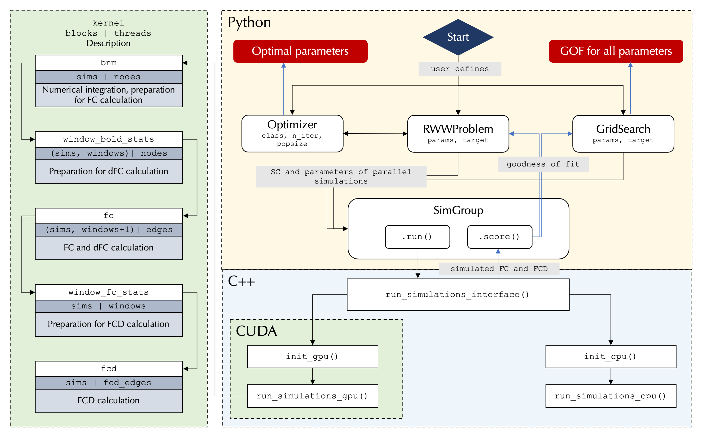

<div align="center">

</div>

The cuBNM toolbox is designed for efficient simulation and optimization of biophysical network models (BNM) of the brain on GPUs.

## Overview
The toolbox supports simulation of network nodes activity based on the reduced Wong-Wang model, with analytical-numerical feedback inhibition control. The Balloon-Windkessel model is utilized for the calculation of simulated BOLD signals. The toolbox calculates the goodness of fit of the simulated BOLD to the empirical BOLD based on functional connectivity (FC) and functional connectivity dynamics (FCD) matrices. The model local parameters (connectivity weight of excitatory and inhibitory neurons) can be homogeneous, or can vary across nodes based on a parameterized combination of fixed maps or using independent free parameters for each node / group of nodes.

Parameter optimization of the model can be performed using grid search or evolutionary optimizers. Parallelization of the entire grid or each iteration of evolutionary optimizers is done at two levels:
1. Simulations (across the GPU ‘blocks’)
2. Nodes (across each block’s ‘threads’)

The toolbox also supports running the simulations on single- or multi-core CPUs, which will be used if no GPUs are detected or when requested by the user. However, the primary focus of the toolbox is on GPU usage.

Below is a simplified flowchart of the different components of the program, which is written in Python, C++, and CUDA:



## Installation
The package requires Python version 3.7 or higher and works on Linux with GCC 12. For GPU functionality, Nvidia GPUs are required.

The easiest way to install is from pip using:
```
pip install cuBNM
```

In some cases, the package should be installed from source:
- To enable parallel simulations on multiple CPU threads using OpenMP (this feature is disabled in the PyPi release due to manylinux constraints)
- If the installation using pip fails or with `import cuBNM` you get an `ImportError` with the error message reporting an "undefined symbol"

To install from source:

```
git clone https://github.com/amnsbr/cuBNM.git
cd cuBNM && pip install .
```

The installation from srouce also requires [GSL 2.7](https://www.gnu.org/software/gsl/). If GSL is not found (in `"/usr/lib", "/lib", "/usr/local/lib", "~/miniconda/lib", $LIBRARY_PATH, $LD_LIBRARY_PATH`) it will be installed and built by the package in `~/.cuBNM/gsl`, but this takes a rather long time (5+ minutes). If you have GSL 2.7 installed find the location of its libraries `libgsl.a` and `libgslcblas.a` and add the directory to `$LIBRARY_PATH`. 

## Usage
In `./examples/examples.py` you can find some examples of running a single simulation (`run_sims`), grid search (`run_grid`) or CMAES optimization (`run_cmaes_optimizer`). More comprehensive documentations and examples will be added.